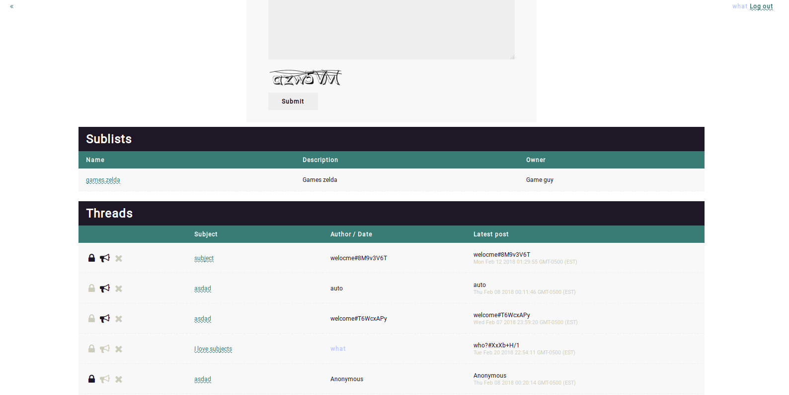

# Impala
Express.js forum

## Prereqs
- MongoDB
- Node
- Express

## Usage
`npm install`
`npm start`

## Todo

- [ ] Add management options
- [x] Re-write front-end to be less messy and look better
- [x] Add permission checking middleware

## Screenshot

## Features
- Administration tools
- Login system
- Modular front-end design
- Tree-based list system
- User-made forums
- Captcha

## Writing a front-end

Impala allows anyone to write their own front-end. Here's how to write one.

##### Public directory

Your front-end must have a `public` directory in the main `fe` directory. Store javascripts, stylesheets and images needed for your front-end in this directory, and access them through `/public/<name>` on the site.

Additionally, if you want a favicon, you should put a `favicon.ico` in the `public` directory.

##### View directory

Your front-end also needs a `views` directory in the main `fe` root. Impala uses `pug`, and you'll need to write five pug files for your front-end:

- `error.pug` for caught errors
- `index.pug` for the home home page
- `list.pug` for list pages
- `thread.pug` for thread pages
- `login.pug` for the login page

These pug files go in the `views` directory. Additionally, it is recommended you have a `layout.pug` which all files extend, as well as a `templates` directory with any mixins you'll need.

##### Back-end variables

To render your page, you will need the information found by the back-end. The following variables can be accessed in both the `list` pug and the `thread`:

- `captcha` for the captcha in SVG format
- `settings` for the settings of the current board and properties

The following variables can be accessed in the `list` pug:

- `lists` for a list of child lists
- `threads` for a list of threads in the current list

The following variables can be accessed in the `thread` pug:

- `posts` for a list of posts in the current thread

##### Writing to the back-end

When the user wants to post to a list or thread, he sends a `POST` request to `/site/<list>/[<thread>/]` with the following properties:

- `text` for the content of the post
- `username` for the name of the poster
- `email` for the email of the poster
- `subject` for the subject of the post

When the user wants to create a list, he send a `POST` request to `/site/` with the following properties

- `name` for the name of the list
- `description` for a description of the list
